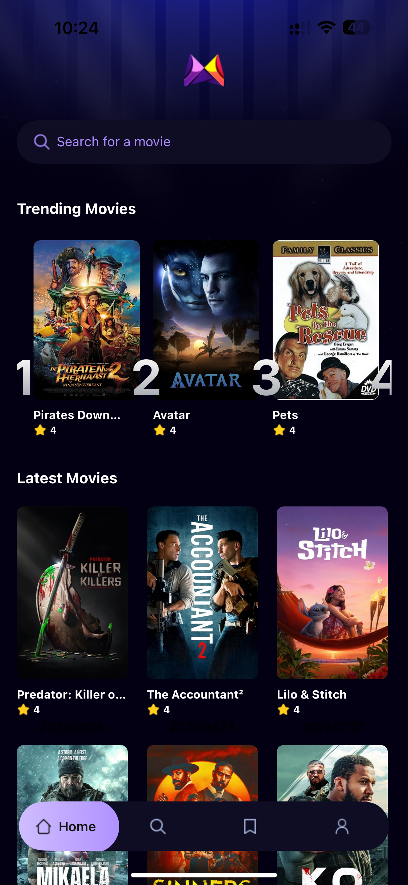

# 🎬 Movie App

A cross-platform **React Native + Expo** movie discovery app powered by the [TMDb API](https://www.themoviedb.org/).  
Built with a **scalable, component-driven architecture** and optimized for performance, the app delivers real-time data, fast search, and personalized recommendations.

---

## 🚀 Tech Stack

- **React Native** — cross-platform mobile development
- **Expo Framework** — simplified builds & native modules
- **TypeScript** — type safety and maintainability
- **TailwindCSS (NativeWind)** — utility-first styling
- **Appwrite** — backend integration (auth, database, future CRUD support)
- **TMDb API** — real-time movies & TV data

---

## ✨ Features

- 🔎 **Debounced High-Performance Search** — instant results with API request optimization
- 📊 **Personalized Trending Algorithm** — adapts to user’s viewing/search history
- ⚡ **Robust Loading & Error Handling** — seamless user experience
- 🧩 **Scalable Component-Driven Architecture** — ready for full CRUD expansion via Node.js backend
- 📱 **Cross-Platform** — works on both iOS and Android out of the box

---

## 🛠️ Planned Features / Roadmap

- 🔖 **Bookmark Screen** — save and manage your favorite movies
- 👤 **Profile Screen** — personalized user profile with settings and activity
- ✍️ **Full CRUD via Node.js Backend** — manage user data, watchlists, and preferences
- 📺 **Extended Media Support** — TV shows, trailers, and recommendations

---

## 📸 Screenshots



---

## ⚡ Getting Started

1. Clone the repo:
   ```bash
   git clone https://github.com/your-username/movie-app.git
   cd movie-app
   ```
